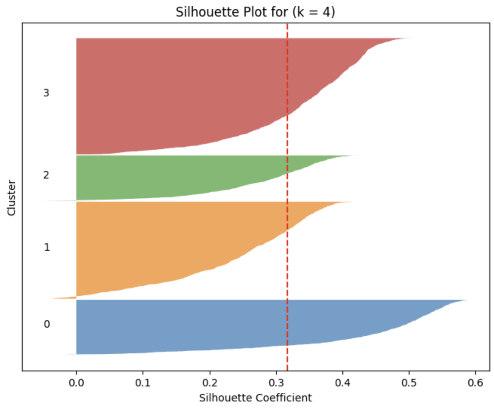

# Case Description and Key Findings

---

## 1. Business Context

**Client and problem**

MegaMart is a large retail company that wants to better understand its customer base in order to improve **marketing, retention, and personalization**.  
The project’s main objective is to perform **customer segmentation** based on behavioral and transactional data to identify **distinct customer groups** and adapt strategies for each segment.

**Strategic importance of the analysis**

- Enables **targeted marketing campaigns**, rather than one-size-fits-all promotions.  
- Supports **retention and loyalty programs** by identifying high-value and at-risk customers.  
- Helps optimize **resource allocation** (budget, discounts, service levels) for the most valuable or sensitive segments.  
- Provides a **data-driven foundation** for long-term CRM and personalization initiatives.

---

## 2. Methodology

**Multivariate method applied**

- **Unsupervised clustering**:
  - **Hierarchical Clustering** (Ward linkage) for exploratory analysis and to suggest the number of clusters.  
  - **K-Means Clustering** for the final segmentation and interpretation.

**Justification of the choice**

- The business question is **segmentation**, not prediction → unsupervised methods are appropriate.  
- Clustering on multiple behavioral variables is a **classical multivariate approach** for creating customer segments.  
- **Hierarchical Clustering (Ward)** provides an intuitive, visual way (dendrogram) to inspect the structure and possible number of clusters.  
- **K-Means**:
  - Scales well to ~3,000 customers.  
  - Produces **centroids** that are easy to interpret as “typical” customers per segment.  
  - Widely used and supported in standard ML libraries.

**Tools and libraries used**

- **Python** (Jupyter Notebook: `cluster_analysis.ipynb`)
- **Libraries**:
  - `pandas`, `numpy` for data handling  
  - `matplotlib`, `seaborn` for EDA and visualization  
  - `scikit-learn` for `StandardScaler`, `KMeans`, `PCA`, and silhouette score  
  - `scipy` for hierarchical clustering and dendrograms

---

## 3. Data

**Dataset description**

- ~**3,000 customers**, each row = one customer.  
- **10 variables**:
  - 1 identifier: `customer_id`  
  - 9 behavioral/transactional features used for clustering.

**Key variables**

Examples of key features:

- `monthly_transactions` – average number of purchases per month.  
- `avg_basket_size` – average number of items per order.  
- `total_spend` – cumulative customer spending.  
- `avg_session_duration` – average time per online session.  
- `email_open_rate` – proportion of marketing emails opened.  
- `product_views_per_visit` – depth of product browsing.  
- `return_rate` – fraction of orders that are returned.  
- `customer_tenure_months` – months since first purchase.  
- `recency_days` – days since last purchase.

All 9 features are **numeric and continuous**, with **no missing values**, which makes them suitable for distance-based clustering after standardization.

**Link to data dictionary**
[Data Dictionary](data/DATA_DICTIONARY.md)

---

## 4. Main Findings

### 4.1 Key findings (3–5 bullet points)

- The optimal balance between interpretability and separation is obtained with **4 clusters** (segments), based on **hierarchical clustering (Ward)**, **elbow method (inertia)**, and **silhouette scores**.  
- The four segments correspond to clear behavioral profiles:
  1. **Loyal Customers** – high spend, frequent purchases, large baskets, high engagement, low returns.  
  2. **High Returners** – very low spend, few purchases, long sessions, **very high return rate**, low email engagement.  
  3. **Seasonal Shoppers** – infrequent but **high-value** purchases, large baskets, often event/season driven, higher returns.  
  4. **New and Casual Shoppers** – largest group, moderate frequency, small baskets, low–medium spend, low returns, shorter tenure.  
- The **average silhouette score** for the final K-Means model with 4 clusters is **~0.32**, indicating **moderate but meaningful separation**, with particularly well-defined Loyal and New/Casual clusters.  
- **PCA visualization** (PC1 + PC2 explaining ~62% of the variance) confirms that clusters are distinguishable in a lower-dimensional space, especially the high-value Loyal segment vs. lower-value segments.

### 4.2 Highlight visualization

### 4.3 Model performance metrics

- **K-Means (final model)**:
  - Number of clusters: **k = 4**  
  - Average **silhouette score**: ≈ **0.3173**  
  - **Inertia (within-cluster sum of squares)**: ≈ **11,944**  

- **Hierarchical Clustering (Ward)**:
  - Silhouette scores by candidate k (example values):
    - k = 3 → ~0.29  
    - k = 4 → ~0.32 (best trade-off)  
    - k = 5 → ~0.30  
    - k = 6 → ~0.25  

- **PCA**:
  - PC1: ~41% of variance  
  - PC2: ~21% of variance  
  - **Total (PC1 + PC2): ~62% of variance explained**  

These metrics indicate a **reasonable quality** segmentation that is both interpretable and practically useful.

---

## 5. Business Recommendations

### 5.1 Three actionable recommendations

1. **Develop a VIP / Loyalty Program for “Loyal Customers”**  
   - Offer exclusive discounts, early access to promotions, and personalized product recommendations.  
   - Use their high email open rates for targeted campaigns and cross-selling.

2. **Reduce Friction and Clarify Product Information for “High Returners”**  
   - Improve product descriptions, sizing guides, and customer reviews.  
   - Highlight easy-return policies and provide proactive support (chat or FAQ) during checkout.  
   - Analyze their most frequently returned categories to detect catalog or logistics issues.

3. **Design Seasonal and Event-Based Campaigns for “Seasonal Shoppers” and Onboarding Flows for “New & Casual Shoppers”**  
   - Seasonal Shoppers: launch **time-limited bundles and promotions** around holidays, back-to-school, etc.  
   - New & Casual Shoppers: implement **welcome journeys** (series of onboarding emails with recommendations, small incentives, and education about benefits of buying more frequently).

### 5.2 Expected impact

- **Revenue growth:**  
  - Boosting the spending of Loyal and Seasonal segments can significantly increase total revenue due to their already high potential.  

- **Margin protection:**  
  - Reducing unnecessary returns from High Returners improves profitability and operational efficiency (less logistics cost, fewer refunds).  

- **Customer lifetime value (CLV):**  
  - Converting New & Casual Shoppers into more engaged, higher-spend customers increases CLV over time.

### 5.3 Next steps

- **Operationalization:**  
  - Integrate the cluster assignments into MegaMart’s CRM or marketing automation platform to enable real-time segment-based campaigns.  

- **Model refinement:**  
  - Add **demographic and product-category variables** to refine segments and test whether a different number of clusters becomes optimal.  

- **Continuous monitoring:**  
  - Re-run the clustering periodically (e.g., quarterly) to monitor **segment stability**, measure campaign performance by segment, and adjust strategies as customer behavior evolves.

---

